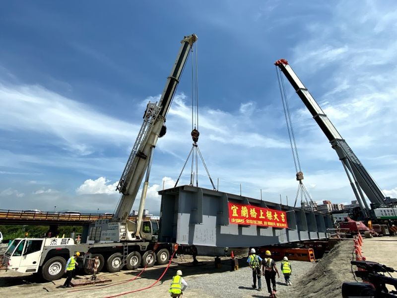

# 108-2-S0727120-P4
p4
<html>
<head>
<title>期末作業-4</title>
</head>
<body bgcolor="#CD8500">
<h1>宜蘭橋改建工程上梁 預計年底前完工通車</h1>

<h3>記者李清貴/綜合報導</h3>

宜蘭橋改建工程，今（19）日上午舉行上梁典禮，預計今（109）年9月前完成主橋橋面版，年底前完工通車。

宜蘭橋改建工程今天上午舉行上樑典禮，由縣長林姿妙主持，包括宜蘭市長江聰淵及多位地方民代都出席這項儀式﹔ 
林姿妙表示，宜蘭橋改建總經費5億元，中央補助4億5000萬，宜蘭縣政府編列5000萬，預計年底完工通車，完工之後，宜蘭河通洪能力將會更好。

縣府交通處表示，宜蘭橋是宜蘭市連外樞鈕，因為橋梁老舊，原始設計的通洪能力不能滿足宜蘭河治理計畫，因此縣府籌措經費進行改建， 
去（108）年8月13日拆除改建以來，已大致完成新橋梁下部結構59支基樁、2座橋台及3座橋墩， 
今天起開始進行橋梁上部結構之鋼梁吊裝作業，今年9月前完成主橋橋面版，待人行道及橋下空間工程完成後，可望依原訂期程於年底前通車啟用。

</body>

</html>
